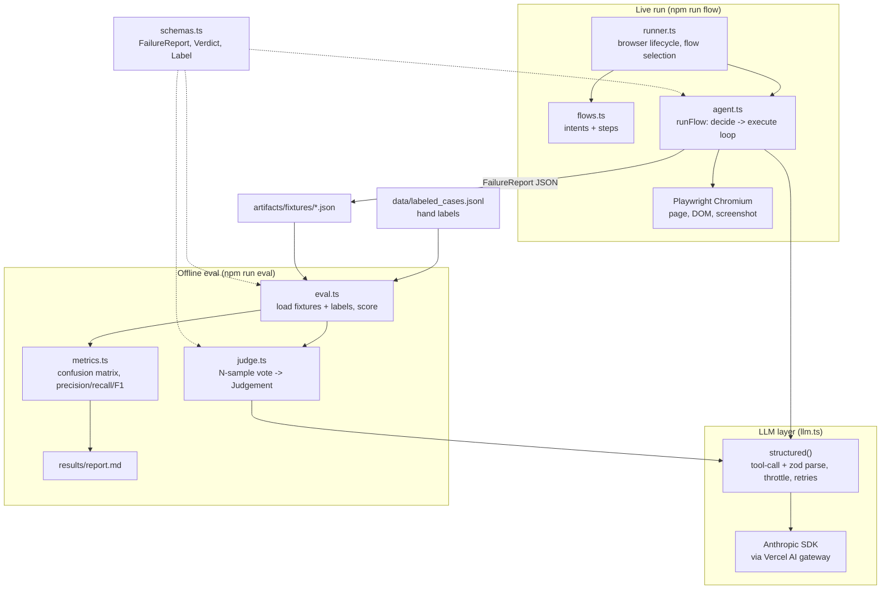

# Holmes-Watson: Automated QA Triage

An autonomous QA browser agent finds "failures." A second-stage LLM judge decides
which ones are **real bugs** worth filing, and kills the rest before they reach a
developer's tracker.

This is a weekend rebuild of what I think is the hardest sub-problem behind an
autonomous-QA product: not *finding* candidate failures, but *trusting* them enough
to file. The whole pitch is one number: the gap between **39%** (what hits the
backlog with no triage) and **100%** (what hits it after the judge), with no real
bug dropped except one honest edge case.

## Purpose and Scope

Traditional automated tests are brittle: a renamed selector or a reworded button
breaks the suite. Holmes-Watson uses LLMs to test against stated **intent** instead
of hardcoded assertions, which is more resilient but introduces a new problem,
**over-reporting**. An agent that interprets visual and structural change will flag
async content that has not loaded, valid-but-unexpected copy, and intentional empty
states as failures. A noisy QA bot that files non-bugs gets muted in week one.

The system attacks that with three capabilities:

- **Autonomous execution** using Playwright plus an LLM that navigates from
  high-level natural-language intents, one action at a time.
- **Noise reduction** through a dedicated triage layer that filters false positives
  before anything is filed.
- **An offline evaluation framework** that measures triage accuracy against 18
  human-labeled ground-truth cases, so the judge is scored, not trusted blindly.

## The triage labels

Every reported failure is classified against the flow's stated intent (the oracle
anchor), into exactly one of:

- `real-bug` a genuine defect. File it. (broken asset, 4xx/5xx, a control that does
  nothing, data not saved, a clearly broken layout)
- `flaky` timing or non-determinism. A re-run would pass. Do not file. (async not
  loaded, slow resource, A/B-tested or randomised content)
- `agent-misunderstanding` the product was correct and the agent misread success.
  (different-but-valid copy, an intentional empty or default state, a valid alternate
  flow)

Only `real-bug` at confidence >= 0.8 is filed. `filed` is a calibration decision,
not the raw model number.

## System Architecture

The codebase splits into modules for browser automation, LLM interaction, and result
classification. The eval path reuses the same `judge` and `schemas`, so scoring runs
offline against committed fixtures with no browser.

### High-Level Component Interaction



### Data Flow: From DOM to Verdict

Raw browser state is translated into structured natural-language reasoning, then back
into a typed, gated decision.

```mermaid
flowchart LR
    dom["Page DOM + screenshot<br/>(code entity space)"]
    excerpt["domExcerpt()<br/>strip head/script/style,<br/>collapse whitespace, slice"]
    decide["decide()<br/>intent + step + DOM + image"]
    action["Action<br/>click | fill | goto | done | fail"]
    report["FailureReport<br/>(natural language space)"]
    render["render()<br/>intent vs observed behaviour"]
    samples["N judge samples"]
    vote["vote()<br/>majority label + mean confidence<br/>+ agreement"]
    gate{"label == real-bug<br/>and conf >= 0.8 ?"}
    file["File to backlog"]
    drop["Drop"]

    dom --> excerpt --> decide --> action
    action -->|"kind == fail"| report
    report --> render --> samples --> vote --> gate
    gate -->|yes| file
    gate -->|no| drop
```



## Core Components

| File | Responsibility |
| --- | --- |
| `src/runner.ts` | CLI entry for live runs. Launches Chromium, selects flows (`--all` or `--flow <id>`), writes one `FailureReport` JSON per reported failure into `artifacts/fixtures/`. |
| `src/flows.ts` | The test catalogue: five flows over `saucedemo.com` and `the-internet.herokuapp.com`, each with an `intent`, a `start_url`, and ordered `steps`. |
| `src/agent.ts` | The agent loop. `runFlow` walks the steps; `decide` asks the LLM for one `Action` from the DOM excerpt plus a screenshot; `execute` runs it via Playwright. A failed action gets one reconsider-retry before it emits a failure. |
| `src/llm.ts` | The single LLM call site. `structured()` does a forced tool call, zod-validates the result, retries up to 3 times, and serialises calls through a throttle queue. Reads `AI_GATEWAY_API_KEY`, talks to Anthropic via the Vercel AI gateway. |
| `src/judge.ts` | The triage layer. Renders a report as intent-vs-observed, runs `JUDGE_SAMPLES` independent classifications, and `vote()`s: the winning label's share is `agreement`, a label-free confidence proxy. |
| `src/eval.ts` | Offline harness. Loads committed fixtures and hand labels, runs the judge on the intersection, writes `results/report.md`. No browser needed. |
| `src/metrics.ts` | Scoring math: confusion matrix, precision/recall/F1 on `real-bug`, the raw-agent baseline, and the gated `filed` counts. Also renders the report markdown. |
| `src/schemas.ts` | Zod schemas and types shared across both paths: `FailureReport`, `Verdict`, `Label`, `LabeledCase`. |

## How it runs

```bash
npm install
# put AI_GATEWAY_API_KEY in .env

# Live: drive the agent against the sites, write failure fixtures
npm run flow -- --all
npm run flow -- --flow saucedemo_checkout

# Offline: judge the labeled fixtures and regenerate the report
npm run eval

# Sanity checks
npm test          # metrics math self-check
npm run typecheck
```

Key environment variables: `AI_GATEWAY_API_KEY` (required), `JUDGE_SAMPLES`
(default 1; the headline results use 3), `ANTHROPIC_MODEL` /`AGENT_MODEL`
/`JUDGE_MODEL` (default `anthropic/claude-haiku-4.5`), `LLM_DELAY_MS`, `HEADED`.

## Evaluation and Metrics

The judge is scored against 18 human-verified cases. Counts matter more than rates
here because n is small.

| Metric | Result | Description |
| --- | --- | --- |
| Filed (real-bug, conf >= 0.8) | **6, all 6 real, 0 wrong** | What reaches the backlog after triage |
| Judge precision on real-bug | **100%** (6/6) | Share of predicted real-bug that are actually bugs |
| Raw-agent baseline | **39%** (7/18) | Precision if every agent failure were filed |
| Recall / F1 | **86% / 0.92** | Real bugs caught, and the balance with precision |
| Agreement | 0.0 - 1.0 | Consistency across the N judge samples for one case |

Full per-case table and confusion matrix in [`results/report.md`](results/report.md).
The two misses are both honest edge cases (a `flaky` A/B page read as
`agent-misunderstanding`, and a 404-reference page whose "real-bug" label is
arguably wrong), and both show low `agreement` (0.67), which is exactly the signal a
human review loop would catch.

## The harder problem this points at

Scoring a judge on 18 hand-labeled cases is the easy version. You cannot hand-label
every customer's app, and apps drift. The real open problem is **trust measurement
without ground-truth labels, at scale.** This repo sketches the path:

- The N-sample **agreement** score is a label-free confidence proxy. Low agreement
  flags cases the judge itself is unsure about, before any human looks.
- Confidence is **gated, not trusted blindly**. `filed` is a calibration decision.
- The **cheap-label loop**: route low-agreement / low-confidence cases to a human,
  and those become the next batch of labels.

That is the part worth building next.
