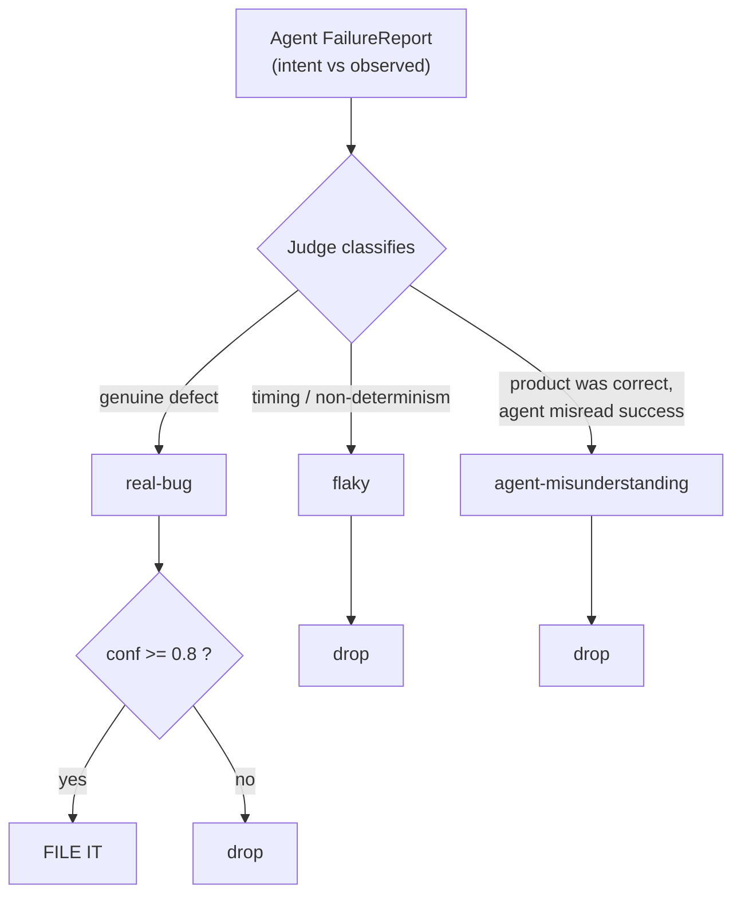
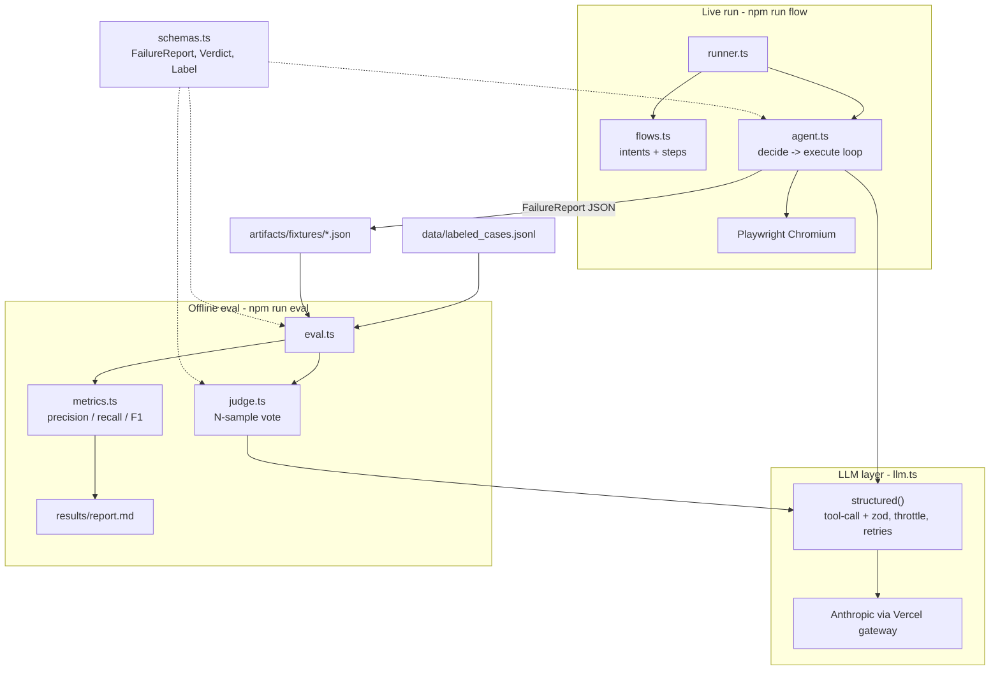
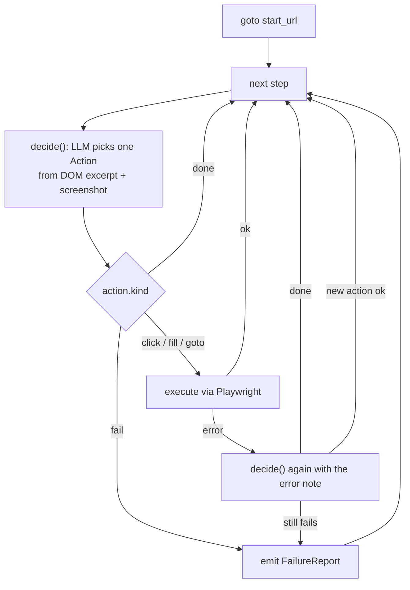
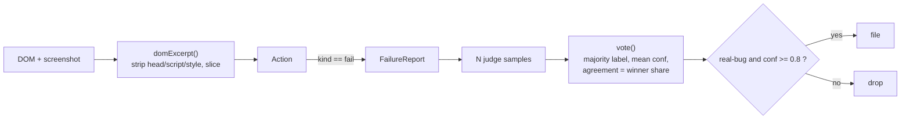
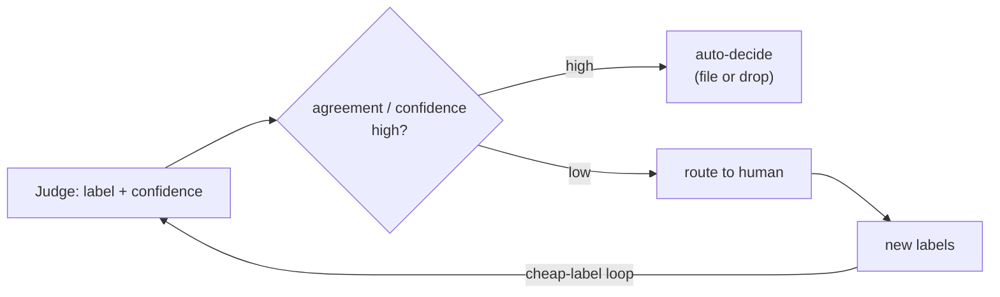

# Holmes-Watson: Automated QA Triage

An autonomous QA browser agent finds "failures." A second-stage LLM judge decides
which ones are **real bugs** worth filing, and kills the rest before they reach a
developer's tracker. The whole pitch is one number: **39%** of raw agent reports are
real bugs; after the judge, **100%** of filed ones are.

## Purpose

LLM-driven tests check against stated **intent**, not brittle selectors, so they
survive a renamed button. The cost is **over-reporting**: the agent flags async
content, valid-but-odd copy, and intentional empty states as failures. A noisy QA bot
gets muted in week one. The triage layer is the fix.

## The triage decision



`filed` is a calibration decision, not the raw model number.

## System Architecture



## Agent loop

`runFlow` walks a flow's steps; each step gets one reconsider-retry before it reports.



## Data flow: DOM to verdict



## Core Components

| File | Responsibility |
| --- | --- |
| `src/runner.ts` | CLI for live runs. Launches Chromium, selects flows, writes a `FailureReport` JSON per failure. |
| `src/flows.ts` | Five flows over `saucedemo.com` and `the-internet.herokuapp.com`: `intent`, `start_url`, `steps`. |
| `src/agent.ts` | The agent loop above: `runFlow`, `decide`, `execute`, `emit`. |
| `src/llm.ts` | Single LLM call site. Forced tool call, zod-validated, 3 retries, throttle queue. |
| `src/judge.ts` | Triage layer. `JUDGE_SAMPLES` classifications, `vote()` yields label + confidence + agreement. |
| `src/eval.ts` | Offline harness. Fixtures + labels in, `results/report.md` out. No browser. |
| `src/metrics.ts` | Confusion matrix, precision/recall/F1, baseline, gated `filed` counts, report renderer. |
| `src/schemas.ts` | Shared zod schemas: `FailureReport`, `Verdict`, `Label`, `LabeledCase`. |

## Run it

```bash
npm install              # put AI_GATEWAY_API_KEY in .env
npm run flow -- --all    # live: drive the agent, write fixtures
npm run eval             # offline: judge fixtures, regenerate report
npm test                 # metrics math self-check
npm run typecheck
```

Env: `AI_GATEWAY_API_KEY` (required), `JUDGE_SAMPLES` (default 1; headline uses 3),
`ANTHROPIC_MODEL` / `AGENT_MODEL` / `JUDGE_MODEL` (default `anthropic/claude-haiku-4.5`),
`LLM_DELAY_MS`, `HEADED`.

## Results

18 human-labeled cases. Counts over rates, because n is small.

| Metric | Result |
| --- | --- |
| Filed (real-bug, conf >= 0.8) | **6, all real, 0 wrong** |
| Judge precision on real-bug | **100%** (6/6) |
| Raw-agent baseline | **39%** (7/18) |
| Recall / F1 | **86% / 0.92** |

Full table in [`results/report.md`](results/report.md). The two misses both show low
`agreement` (0.67), the exact signal a human-review loop would catch.

## The harder problem

Hand-labeling 18 cases is the easy version. Apps drift and you cannot label every
customer's app. The open problem is **trust measurement without ground-truth labels**.


